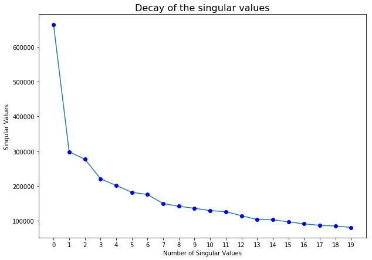
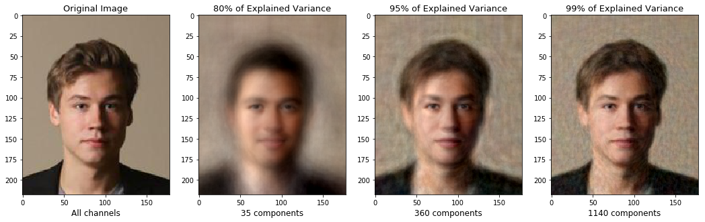
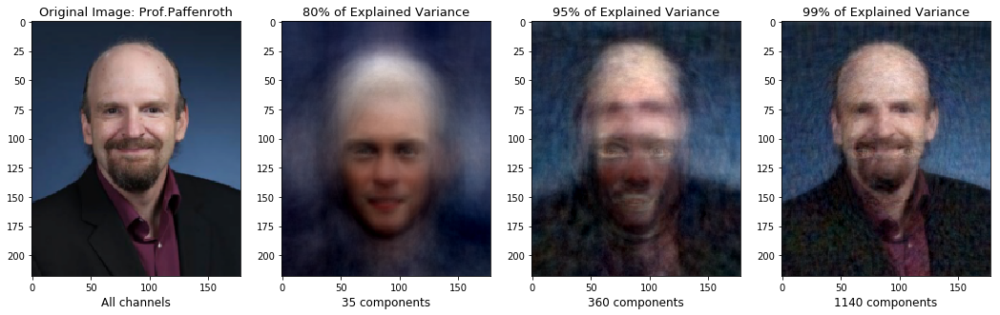

# Dimensional reduction on CelebA dataset &amp;&amp; Reconstruct Images using PCA

Data Source:http://mmlab.ie.cuhk.edu.hk/projects/CelebA.html

We apply PCA on CelebA dataset. In order to save time, we only apply PCA to 2000 images with the smaller size (219,178,3) instead of all full images in the dataset. Here is the line chart of  decay of the singular values (The chart only use the largest 20 of them):

After applying singular value decomposition, we reconstructed our portrait data using 35, 360 and 1140 principal components, which represent accordingly 80%, 95% and 99% of explained variance. Noticing that though the knee of above chart is clearly lying on 3-10, in order to get an acceptable result, the number of components we have chosen will be much more than that due to the nonlinearity of the images.

Here are the two examples of results:

We speculate that since Prof. Paffenroth’s image has the background of a different setting with other images in the CelebA, the reconstruction of his image needs a few more additional components. E.g. The original image is centered by the people’s eyes and with light background.
